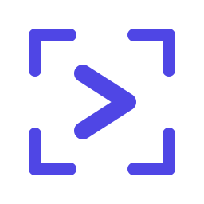
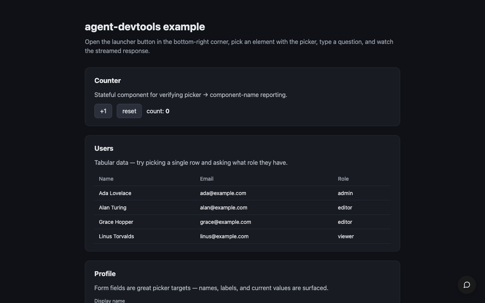

<p align="center">
  
</p>

<h1 align="center">agent-devtools</h1>

<p align="center">
  <strong>당신이 띄워둔 앱 안의 Claude Code.</strong>
</p>

<p align="center">
  화면 위 어떤 컴포넌트든 픽해서 가리키면, 떠 있는 채팅창 안에서 에이전트가 코드를 읽고 직접 파일을 고친다. IDE 로 메시지를 떠넘기지 않고, 새 로그인이나 별도의 벤더 API 키도 만들지 않는다 — 이미 쓰고 있는 Claude Pro/Max 구독을 Claude Code CLI 의 OAuth 로 그대로 재사용한다.
</p>

<p align="center">
  <a href="./README.md">English</a> · <strong>한국어</strong>
</p>

<p align="center">
  <a href="https://www.npmjs.com/package/@agent-devtools/core"></a>
  <a href="https://www.npmjs.com/package/@agent-devtools/core"></a>
  <a href="https://github.com/Seungwoo321/agent-devtools/actions/workflows/ci.yml"></a>
  <a href="https://agent-devtools-docs.vercel.app/guides/security/#dev-only-guard-2-layer"></a>
  <a href="./LICENSE"></a>
</p>

<p align="center">
  <sub><strong>production no-leak</strong> 배지는 <a href="https://agent-devtools-docs.vercel.app/guides/security/#dev-only-guard-2-layer">2-layer dev-only guard</a> 의 결과다 — 빌드 시점에 production 그래프에서 위젯 chain 을 배제하고, 런타임에 <code>NODE_ENV</code> 를 한 번 더 검사한다. 모든 example 은 심볼 스캐너 (<a href="./scripts/check-no-leak.mjs"><code>scripts/check-no-leak.mjs</code></a>) 를 갖추며 CI 매트릭스가 실제 <code>dist/</code>, <code>.next/</code>, <code>.output/</code> 산출물을 매 push 마다 검사한다.</sub>
</p>

## Demo



위젯에서 비활성화된 "장바구니 담기" 버튼을 픽하고 "사이즈를 골랐는데 왜 계속 disabled 야?" 라고 묻는다. 에이전트는 React fiber 체인을 거슬러 `ProductDetail` 부모까지 따라가고, picker 가 함께 실어 보낸 import 들(`useCart`, `selectors/inventory.ts`)을 따라가며 핸들러와 selector 실제 코드를 읽는다. 그러고 나서 빠져 있는 의존을 설명하거나 곧바로 `Edit` 으로 고친다. "이 리스트가 mutation 후에 왜 갱신 안 돼?", "이 폼이 validation 에러를 삼키는데 어디서 잡고 있어?" 같은 질문도 같은 흐름으로 처리된다 — picker 가 이미 컨텍스트를 패키징했기에 에이전트가 grep 부터 시작하지 않는다.

- 사용자 가이드 (en / ko): <https://agent-devtools-docs.vercel.app/>
- 작동 원리 (한 장의 다이어그램): <https://agent-devtools-docs.vercel.app/guides/how-it-works/>
- 컨텍스트·스코프: [`CONTEXT.md`](./CONTEXT.md)

## 카테고리 안에서의 위치

가장 가까운 이웃 도구들과의 사실 기반 비교. 우열이 아니라 축이 다르다.

| 축                     | agent-devtools                                                                                               | In-page → IDE 포워더 (예: Stagewise)    | 브라우저 devtools 확장 (예: React DevTools) | In-app 피드백 위젯 (예: ProductLift, Pastel) |
| ---------------------- | ------------------------------------------------------------------------------------------------------------ | --------------------------------------- | ------------------------------------------- | -------------------------------------------- |
| 누가 코드를 수정하는가 | 에이전트, 브라우저 탭 안에서                                                                                 | 별도 에디터/IDE 의 에이전트가 ping 받음 | 아무도 — 읽기 전용 inspection               | 아무도 — 백로그 아이템으로 캡처              |
| IDE 필요 여부          | 아니오                                                                                                       | 예 (Cursor / VS Code 등)                | 아니오 (브라우저만)                         | 아니오                                       |
| 픽한 컨텍스트 패키징   | `PickedEvidence` (컴포넌트 체인, 소스 경로, selector, outerHTML — source slice / related imports 로 확장 중) | URL + 스크린샷 + 선택 element           | 해당 없음                                   | 스크린샷 + 페이지 URL                        |
| 구독 모델              | 본인의 Claude Pro/Max (CLI OAuth 재사용)                                                                     | 본인의 모델 API 키                      | 없음                                        | 벤더 구독                                    |
| Production 번들 바이트 | 0 (2-layer dev-only guard)                                                                                   | 도구마다 다름                           | 0 (확장이라 별도)                           | production 번들에 SDK 임베드                 |
| 권한 경계              | action 별 정책 (`bash`/`webFetch`/`mcpTool` 기본 ask)                                                        | 호스트 에디터의 권한 모델 상속          | 읽기 전용                                   | 해당 없음 (코드 실행 없음)                   |

"브라우저 탭 안에서 에이전트가 직접 수정, IDE 불필요, 추가 구독 없음" 행이 agent-devtools 가 차지하려는 자리다. 다른 행은 적이 아니라 다른 자리의 이웃이다.

## Quick Start

자기 스택에 맞는 행을 고른다. 각 어댑터는 [`examples/`](./examples) 에 실행 가능한 예제와 `pnpm --filter <example> run smoke:no-leak` 로 돌릴 수 있는 production-leak 가드를 갖는다 — production 번들에 widget 코드가 0 바이트 들어가는 것을 검증한다.

| Stack            | 설치                                                           | 예제                                               |
| ---------------- | -------------------------------------------------------------- | -------------------------------------------------- |
| React + Vite     | `pnpm add -D @agent-devtools/vite @agent-devtools/react`       | [`examples/react-vite`](./examples/react-vite)     |
| Vue 3 + Vite     | `pnpm add -D @agent-devtools/vite @agent-devtools/vue`         | [`examples/vue-vite`](./examples/vue-vite)         |
| Vue 2 + Vite     | `pnpm add -D @agent-devtools/vite @agent-devtools/vue2`        | [`examples/vue2-vite`](./examples/vue2-vite)       |
| Angular + Vite   | `pnpm add -D @agent-devtools/vite @agent-devtools/angular`     | [`examples/angular-vite`](./examples/angular-vite) |
| Svelte + Vite    | `pnpm add -D @agent-devtools/vite @agent-devtools/svelte`      | [`examples/svelte-vite`](./examples/svelte-vite)   |
| SvelteKit        | `pnpm add -D @agent-devtools/vite @agent-devtools/sveltekit`   | [`examples/sveltekit`](./examples/sveltekit)       |
| Next.js 15 (App) | `pnpm add -D @agent-devtools/next @agent-devtools/react`       | [`examples/next`](./examples/next)                 |
| Next.js (Pages)  | `pnpm add -D @agent-devtools/next-pages @agent-devtools/react` | [`examples/next-pages`](./examples/next-pages)     |
| Nuxt 3           | `pnpm add -D @agent-devtools/nuxt @agent-devtools/vue`         | [`examples/nuxt`](./examples/nuxt)                 |
| Nuxt 2           | `pnpm add -D @agent-devtools/nuxt2 @agent-devtools/vue2`       | [`examples/nuxt2`](./examples/nuxt2)               |

### React + Vite

```ts
// vite.config.ts
import { defineConfig } from 'vite';
import react from '@vitejs/plugin-react';
import { agentDevtools } from '@agent-devtools/vite';

export default defineConfig({
  plugins: [react(), agentDevtools()],
});
```

### Vue 3 + Vite

```ts
// vite.config.ts
import { defineConfig } from 'vite';
import vue from '@vitejs/plugin-vue';
import { agentDevtools } from '@agent-devtools/vite';

export default defineConfig({
  plugins: [vue(), agentDevtools({ framework: 'vue' })],
});
```

### Next.js 15 (App 또는 Pages Router)

```ts
// next.config.ts
import type { NextConfig } from 'next';
import { withAgentDevtools } from '@agent-devtools/next';

const config: NextConfig = { reactStrictMode: true };
export default withAgentDevtools(config);
```

```tsx
// app/agent-devtools.tsx (App Router) — 또는 _app.tsx 에서 호출 (Pages Router)
'use client';
import { useEffect } from 'react';
import { bootstrapAgentDevtools } from '@agent-devtools/next/bootstrap';

export function AgentDevtools(): null {
  useEffect(() => {
    bootstrapAgentDevtools();
  }, []);
  return null;
}
```

### Nuxt 3

```ts
// nuxt.config.ts
export default defineNuxtConfig({
  modules: ['@agent-devtools/nuxt'],
});
```

### Vue 2 + Vite

```ts
// vite.config.ts
import { defineConfig } from 'vite';
import vue2 from '@vitejs/plugin-vue2';
import { agentDevtools } from '@agent-devtools/vite';

export default defineConfig({
  plugins: [vue2(), agentDevtools({ framework: 'vue2' })],
});
```

### Nuxt 2

```js
// nuxt.config.js
export default {
  modules: ['@agent-devtools/nuxt2'],
  build: {
    // Nuxt 2 는 webpack 4 + babel-loader 를 사용하고 node_modules 는 기본적으로
    // transpile 대상에서 제외된다. widget chain 이 끌어오는 marked 가 webpack 4
    // 가 파싱 못 하는 최신 문법을 포함하므로 transpile 에 명시한다.
    transpile: [
      '@agent-devtools/nuxt2',
      '@agent-devtools/vue2',
      '@agent-devtools/widget-core',
      '@agent-devtools/core',
      'marked',
    ],
  },
};
```

### Angular + Vite

```ts
// vite.config.ts
import { defineConfig } from 'vite';
import angular from '@analogjs/vite-plugin-angular';
import { agentDevtools } from '@agent-devtools/vite';

export default defineConfig({
  plugins: [angular(), agentDevtools({ framework: 'angular' })],
});
```

### Svelte + Vite

```ts
// vite.config.ts
import { defineConfig } from 'vite';
import { svelte } from '@sveltejs/vite-plugin-svelte';
import { agentDevtools } from '@agent-devtools/vite';

export default defineConfig({
  plugins: [svelte(), agentDevtools({ framework: 'svelte' })],
});
```

### SvelteKit

```svelte
<!-- src/routes/+layout.svelte -->
<script lang="ts">
  import { onMount } from 'svelte';

  let { children } = $props();

  onMount(async () => {
    if (import.meta.env.PROD) return;
    const { mountAgentDevtoolsSvelteKit } = await import('@agent-devtools/sveltekit');
    mountAgentDevtoolsSvelteKit();
  });
</script>

{@render children()}
```

`import.meta.env.PROD` 는 Vite 의 compile-time 치환이므로 `vite build` 시 Rollup 이 `if` / `await import()` 분기를 통째로 제거한다.

### Next.js (Pages Router)

```ts
// next.config.ts
import { withAgentDevtools } from '@agent-devtools/next-pages';

export default withAgentDevtools({ reactStrictMode: true });
```

```tsx
// pages/_app.tsx
import { useEffect } from 'react';
import { bootstrapAgentDevtools } from '@agent-devtools/next-pages/bootstrap';
import type { AppProps } from 'next/app';

export default function App({ Component, pageProps }: AppProps) {
  useEffect(() => {
    bootstrapAgentDevtools();
  }, []);
  return <Component {...pageProps} />;
}
```

어느 스택이든 `pnpm dev` 를 실행하면:

1. 로컬 에이전트 서버가 `127.0.0.1` 의 free 포트에 자동 spawn 된다 (4317 이 점유면 순차 fallback).
2. 페어링 토큰이 메모리 안에서 발급되고 dev HTML 의 `window.__AGENT_DEVTOOLS_CONFIG__` 에 주입된다 — URL 에는 절대 노출되지 않는다.
3. 페이지에 widget 의 launcher 버튼이 떠 있다. 클릭 → 채팅창 열림 → "Pick" 으로 컴포넌트 선택 → 자연어 요청.
4. `pnpm build` 시 어댑터는 종단간 비활성화. production 번들에는 widget 코드가 0 바이트 들어가지 않는다 ([Security defaults](#security-defaults) 참조).

## Packages

모든 `@agent-devtools/*` 패키지는 단일 공유 버전 라인으로 함께 publish 된다 — 상단의 npm 배지가 항상 현재 릴리즈를 가리킨다.

| Package                                                   | Description                                               |
| --------------------------------------------------------- | --------------------------------------------------------- |
| [`@agent-devtools/core`](./packages/core)                 | 프레임워크-무관 코어 (server, agent engine, transport)    |
| [`@agent-devtools/widget-core`](./packages/widget-core)   | 프레임워크-무관 widget shell (closed Shadow DOM mount)    |
| [`@agent-devtools/harness-core`](./packages/harness-core) | 도메인-무관 loop 전략 + LLM provider 추상화               |
| [`@agent-devtools/react`](./packages/react)               | React 19 fiber walker + DOM picker + auto context         |
| [`@agent-devtools/vue`](./packages/vue)                   | Vue 3 vnode walker + DOM picker + closed shadow widget    |
| [`@agent-devtools/vue2`](./packages/vue2)                 | Vue 2.7 컴포넌트 트리 walker + picker + widget            |
| [`@agent-devtools/angular`](./packages/angular)           | Angular Ivy walker + picker + widget                      |
| [`@agent-devtools/svelte`](./packages/svelte)             | Svelte 4/5 `__svelte_meta` resolver + picker + widget     |
| [`@agent-devtools/sveltekit`](./packages/sveltekit)       | SvelteKit layout mount + server `handle` 바인딩           |
| [`@agent-devtools/next`](./packages/next)                 | Next.js 15 App Router wrapper — webpack alias + bootstrap |
| [`@agent-devtools/next-pages`](./packages/next-pages)     | Next.js Pages Router wrapper — `>= 12` 호환 동일 패턴     |
| [`@agent-devtools/nuxt`](./packages/nuxt)                 | Nuxt 3 module — dev-only plugin 자동 주입                 |
| [`@agent-devtools/nuxt2`](./packages/nuxt2)               | Nuxt 2 module — dev-only client plugin 자동 주입          |
| [`@agent-devtools/vite`](./packages/vite)                 | Vite 플러그인 (5–8) — auto-inject widget + dev-only guard |

## Security defaults

- **dev-only** — 모든 어댑터의 mount entry 는 `NODE_ENV === 'production'` 일 때 즉시 throw 한다 (Layer 2 런타임 가드). 빌드 시 통합 (Vite `apply: 'serve'`, Next webpack alias + DCE, Nuxt `nuxt.options.dev` 게이트) 은 widget 코드 경로가 production 그래프에 진입조차 못 하도록 차단한다 (Layer 1 빌드 가드).
- **production-leak guard** — 각 예제는 `scripts/check-no-leak.mjs` 심볼 기반 스캐너를 갖는다. 실제 production 산출물 (`dist/`, `.next/`, `.output/`) 에서 widget-chain 식별자 (`mountAgentDevtools`, `createDefaultTransport`, `getFiberForElement`, `pumpToSse`, …) 가 한 번이라도 등장하면 build 가 실패한다. CI 가 매 푸시마다 이 매트릭스를 돌린다.
- **127.0.0.1 binding** — 로컬 에이전트 서버는 loopback only. 외부 네트워크 노출 없음. 점유 시 sequential fallback.
- **페어링 토큰** — CLI 시작마다 회전, 메모리 only, 디스크 미저장, URL embed 금지. `Authorization: Bearer …` 헤더로만 전달.
- **closed Shadow DOM** — 호스트 앱 CSS/DOM·상태 격리. React 19 (또는 Vue 3) 별도 모듈 인스턴스로 호스트와의 dual-tree 경계를 둔다.
- **액션 인지 권한 정책** — 런타임이 ACP `ToolKind` 별로 권한 요청을 판정한다. 디폴트 정책은 `fileEdit` (`edit` / `delete` / `move`) 만 자동 허용하고 `bash`, `webFetch`, `mcpTool` 은 사용자가 명시적으로 `bypassPermissions` 로 올리지 않는 한 cancelled. 전체 모드 × 카테고리 매트릭스는 [permission-modes 가이드](https://agent-devtools-docs.vercel.app/guides/permission-modes/) 참조.
- **워크스페이스 경계 (정직한 범위)** — `workspace` 옵션은 스폰되는 Claude Code 자식 프로세스의 canonical `cwd` 이자, picker preamble 의 source-slice 읽기에 쓰이는 in-process `FileTools` 가 `PathOutsideWorkspaceError` 로 강제하는 경계다. **OS 레벨 샌드박스는 아니다** — SDK 가 자체 호출하는 도구는 호스트 사용자의 파일 시스템 권한을 그대로 상속한다. 그 디렉토리에서 터미널로 `claude` 를 직접 실행한 것과 동일한 권한 표면이다. 전체 범위는 [보안 모델](https://agent-devtools-docs.vercel.app/guides/security/#workspace-boundary--%EC%8B%A4%EC%A0%9C%EB%A1%9C-%EA%B0%95%EC%A0%9C%EB%90%98%EB%8A%94-%EB%B2%94%EC%9C%84) 참조.

## Requirements

- Node.js **≥22.13** (LTS Jod) — Node 24+ 에서도 동작
- pnpm **≥11**
- (사용 시) 활성 Claude Pro/Max 구독 (Agent SDK Credit 포함, 2026-06-15 시행)

## Development

```bash
pnpm install
pnpm typecheck
pnpm test
pnpm build:examples  # 모든 어댑터 예제 build + no-leak smoke 까지 돌린다
```

자세한 개발 가이드는 [`CONTRIBUTING.md`](./CONTRIBUTING.md).

## License

[MIT](./LICENSE) © Seungwoo Lee
